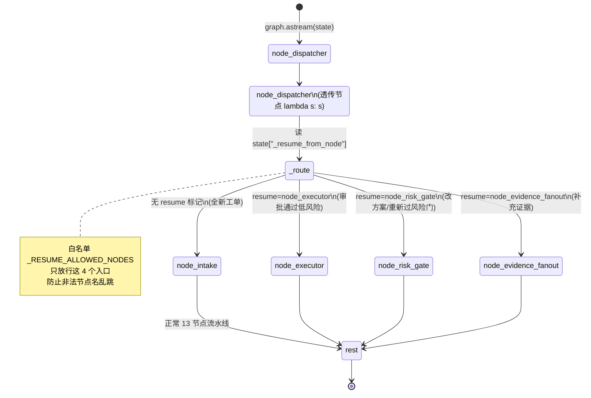
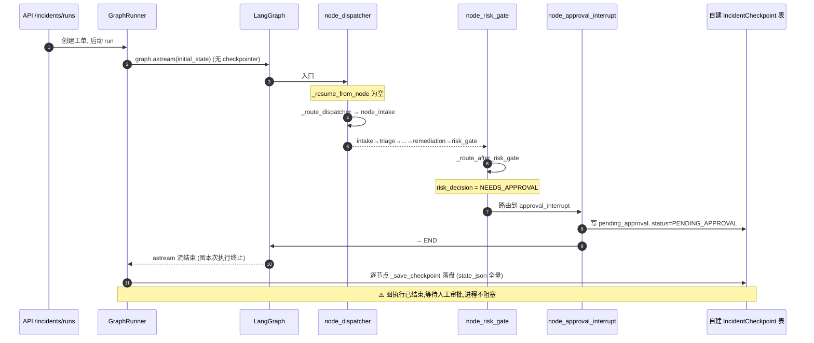
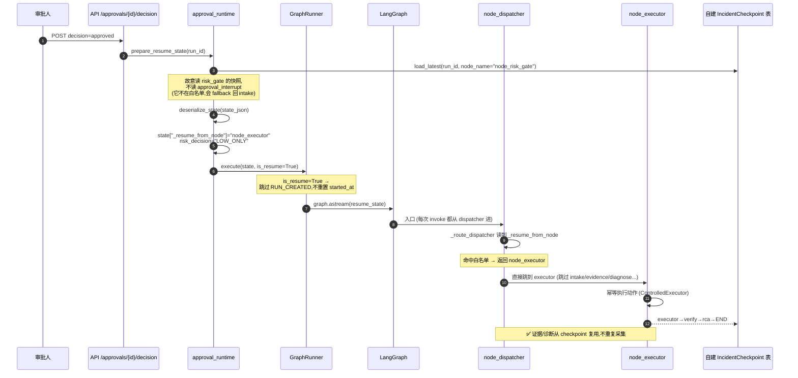

# OpsPilot — Dispatcher / Resume 机制深度拆解

> 配套：`作战计划-agent开发.md` 中"OpsPilot 深挖"高危追问 24/25/37/49 的标准底稿。
> 姊妹篇：[条件路由机制.md](./条件路由机制.md)（critic 回边 / risk_gate / verify 重试等 5 处条件路由）。本篇专讲中断恢复/人工审批。
> 一句话：**项目用的是 LangGraph 0.0.55，现代的 checkpoint 自动续跑 / `interrupt()` HITL / `Send` 扇出都还不存在，所以三套都自建了。**

---

## 0. 必须先记住的事实（否则会被当场戳穿）

| 机制 | LangGraph 原生（教科书答案） | **本项目真实实现** |
|------|------|------|
| Checkpoint 持久化 | `compile(checkpointer=...)`，`MemorySaver`/`SqliteSaver` | ❌ **没用原生**。`create_incident_graph()` 编译时 `checkpointer=None`，自己在 `astream` 循环里逐节点落到自建 `IncidentCheckpoint` 表 |
| 审批中断续跑 (HITL) | `interrupt()` + `Command(resume=...)` | ❌ **0.0.55 没有这套 API**。用 `approval_interrupt` 节点 → END，人工决策后重新 invoke，靠 `node_dispatcher` + `_resume_from_node` 路由到指定节点 |
| 证据并行扇出 | `Send` API (map-reduce) | ❌ **0.0.55 没有 `Send`**。节点内 `asyncio.gather` |

### 版本考古（实测 `langgraph==0.0.55`）

| 能力 | 0.0.55 是否有 |
|------|:---:|
| `MemorySaver` / `SqliteSaver` / `AsyncSqliteSaver` | ✅ |
| `PostgresSaver` | ❌ |
| `interrupt()` / `Command`（现代 HITL） | ❌（import 直接 `ModuleNotFoundError`） |
| `Send` API（map-reduce 扇出） | ❌ |

> 结论：自建不是"重复造轮子"，而是**当时框架根本没有对应的轮子**。这是面试加分点，不是减分点。

---

## 1. 三套机制的职责区分（最容易答混）

| 机制 | 是谁的 | 解决什么 | 类比 |
|------|--------|---------|------|
| **Checkpoint** | 自建（非 LangGraph 原生） | 把 state **存下来 / 读回来** | 游戏「存档」 |
| **Dispatcher / resume** | 自建 | 续跑时该**从哪个节点接着跑** | 读档后「从哪一关开始」 |

Checkpoint 负责**记忆**，dispatcher 负责**导航**。两者配合才完成"审批中断后精准续跑"。

**为什么单靠 checkpoint 不够**：图入口被 `set_entry_point` 写死。即使 state 从 checkpoint 读回来（证据都在），重新 invoke 默认还是从头进。Checkpoint 恢复了"数据"，但没恢复"执行位置"——这正是 dispatcher 这一层的价值。

---

## 2. 状态图：dispatcher 作为统一入口的路由



关键代码（`backend/app/graph/builder.py`）：

```python
graph.add_node("node_dispatcher", lambda state: state)   # 纯透传占位
graph.set_entry_point("node_dispatcher")
graph.add_conditional_edges("node_dispatcher", _route_dispatcher, {...4 个入口...})

_RESUME_ALLOWED_NODES = {"node_intake", "node_executor", "node_risk_gate", "node_evidence_fanout"}

def _route_dispatcher(state):
    resume_node = state.get("_resume_from_node")
    if resume_node and resume_node in _RESUME_ALLOWED_NODES:
        return resume_node      # 续跑：跳到中途节点
    return "node_intake"        # 全新工单：从头
```

---

## 3. 时序图：首次执行 → 命中审批 → 图结束（中断点）



> 注意：checkpoint 不是 LangGraph 自动存的，是 `GraphRunner` 在 `astream` 循环里每个节点后手动 `_save_checkpoint(run_id, node_name, state)`。

---

## 4. 时序图：审批通过 → dispatcher 路由续跑



### 审批决策 → 续跑入口映射（`approval_runtime.py`）

| 审批决策 | `_resume_from_node` | 含义 |
|---------|---------------------|------|
| `approved` | `node_executor` | 批准低风险动作，直接执行 |
| `modify` | `node_risk_gate` | 改了方案，重新过风险门 |
| `more_evidence` | `node_evidence_fanout` | 要求补证据，回扇出 |
| `rejected` | —（不续跑） | 标记 run FAILED |

---

## 5. 面试问答底稿

### Q24/45：LangGraph checkpoint 机制怎么工作的？channel_values 是什么？

**分两层答（先通用知识，再点明项目实际）：**

> 「**通用机制**：LangGraph 原生 checkpoint 以 `thread_id` 为主键，`CheckpointTuple` 存 `channel_values`（全量状态快照）、`channel_versions`（各 channel 版本向量）、`versions_seen`（节点已见版本）、`pending_writes`，原生 saver 有 `MemorySaver`/`SqliteSaver`。
>
> **但我项目没用原生 checkpointer**——用的是 0.0.55，编译时 `checkpointer=None`。我自己实现了一套：用 `astream` 流式拿每个节点输出、手动合并 state、按节点落到自建的 `IncidentCheckpoint` 表（`run_id + node_name + state_json`）。这样做的好处是能跟 `runs`/`events`/`evidence` 业务表 join、前端运行详情页直接查,这是框架内部格式给不了的可观测性。」

### Q25/46：Human-in-the-loop 怎么实现？interrupt 后怎么恢复？

> 「**现代 LangGraph** 是 `interrupt()` 暂停 + `Command(resume=...)` 恢复。但 **0.0.55 没有这套 API**，所以我自己做的：
>
> ① `risk_gate` 判定 `NEEDS_APPROVAL` → 路由到 `approval_interrupt` 节点 → END,整张图**执行结束**,状态落自建 checkpoint,进程不阻塞;
> ② 人工审批后,`approval_runtime` 从 checkpoint 读回 state、反序列化、设 `_resume_from_node`,重新 `astream`;
> ③ 入口 `node_dispatcher`(透传节点 + 条件边)读 `_resume_from_node`,**按审批结果路由到不同节点**——批准走 executor、改方案回 risk_gate、补证据回 evidence_fanout。
>
> 两个安全设计：白名单只放行 4 个续跑入口防乱跳;executor 幂等(`ControlledExecutor` + 审计)防重复执行。」

### Q37/49：你用什么 checkpointer？哪个版本的 LangGraph？

> 「LangGraph **0.0.55**。没用原生 checkpointer(那版只有 Memory/SQLite,没有 Postgres),自建了 `IncidentCheckpoint` 表。如果今天重做,我会用新版 `interrupt()`/`Command` + `PostgresSaver`,把 dispatcher 简化成纯业务路由——但当时版本约束下,自建是正确的工程取舍。」

### 可能的反问：原生 SqliteSaver 不也能续跑吗？

> 「能,但只能续到**中断点**,且状态在框架内部格式里、跟业务库割裂。我需要的是**可控的多入口续跑 + 业务可观测性**——同一个审批通过,可能要进 executor、也可能回 risk_gate 或 evidence_fanout,原生 `interrupt_before` 给不了这种显式多入口路由。所以才自建。」

### 诚实边界（主动说，加分）

> 「自建也有代价:重复了框架后来提供的能力、要自己处理序列化/反序列化、要自己管『哪个节点快照可用』的 corner case(比如 resume 时故意读 `risk_gate` 而不是 `approval_interrupt` 的快照),也没有原生的 time-travel / 分支调试。」

---

## 6. 关键文件速查

| 关注点 | 文件:行 |
|--------|--------|
| dispatcher 节点 + 条件边 | `backend/app/graph/builder.py:177-218` |
| `_route_dispatcher` + 白名单 | `backend/app/graph/builder.py:92-112` |
| 无 checkpointer 编译 | `backend/app/services/graph_runner.py:211` |
| 逐节点手动落 checkpoint | `backend/app/services/graph_runner.py:252-262` |
| resume 状态准备 + 入口映射 | `backend/app/services/approval_runtime.py:78-166` |
| 自建 checkpoint 表 | `backend/app/models/db_models.py:59` |
| 证据并发扇出 (asyncio.gather) | `backend/app/graph/nodes/__init__.py:488` |
