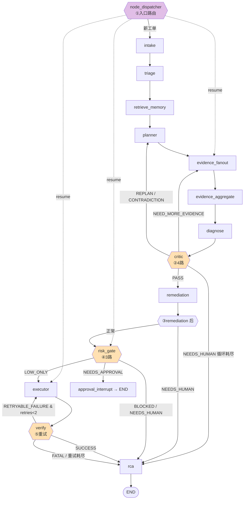

# OpsPilot — 条件路由（Conditional Routing）深度拆解

> 配套：`作战计划-agent开发.md` 的 Q22/23/43/46。
> 姊妹篇：[dispatcher-resume机制.md](./dispatcher-resume机制.md)（中断恢复/人工审批）。本篇专讲 LangGraph 的条件边与图的环形结构。
> 一句话内核：**所有路由决策都是规则硬编码（确定性），不是 LLM 决定的——这是 Harness「控制权归确定性系统」的落地。**

---

## 0. 什么是条件路由

LangGraph 有两种边：

| 边类型 | API | 行为 |
|--------|-----|------|
| 静态边 | `add_edge("A", "B")` | A 跑完无条件去 B |
| **条件边** | `add_conditional_edges("A", path_fn, {返回值: 目标节点})` | A 跑完调 `path_fn(state)`，按返回的字符串查表跳转 |

`path_fn`（path 函数）**只读 state、返回一个目标节点 key**，本身不改 state。OpsPilot 里所有 path 函数都在 `backend/app/graph/builder.py`，决策依据是节点提前写进 state 的 `*_decision` 字段。

**关键设计**：决策（"该走哪"）和执行（"做什么"）分离——节点负责产出 `critic_decision`/`risk_decision`/`verify_decision`，path 函数只负责按这个值查表。决策值由**规则**算出（见各节点），不是 LLM 自由发挥。

---

## 1. 全景：5 个条件路由点

OpsPilot 一共 5 处 `add_conditional_edges`：

| # | 路由点 | path 函数 | 分支 | 是否有回边(loop) |
|---|--------|-----------|------|:---:|
| ① | dispatcher（入口） | `_route_dispatcher` | intake / executor / risk_gate / evidence_fanout | — |
| ② | critic 后 | `_route_after_critic` | remediation / evidence_fanout / planner / rca | ✅ 回边 |
| ③ | remediation 后 | `_route_after_remediation` | risk_gate / rca | — |
| ④ | risk_gate 后 | `_route_after_risk_gate` | executor / approval_interrupt / rca | — |
| ⑤ | verify 后 | `_route_after_verify` | executor / rca | ✅ 重试回边 |



虚线 = 续跑路径（见 dispatcher 篇）。橙色 = 多路条件路由。

---

## 2. ② critic 4 路 + loop-back（最有料）

**代码**：`builder.py:115-124`（路由）+ `nodes/__init__.py:1066-1124`（决策）

```python
def _route_after_critic(state):
    decision = state.get("critic_decision", "PASS")
    if state.get("status") in ("NEEDS_HUMAN", RunStatus.NEEDS_HUMAN):
        return "node_rca"
    if decision == "NEED_MORE_EVIDENCE":   return "node_evidence_fanout"  # 回边
    if decision in ("REPLAN", "CONTRADICTION"): return "node_planner"     # 回边
    return "node_remediation"
```

**决策值怎么来的（全是规则，不是 LLM）**：

| critic_decision | 触发规则 | 路由去向 |
|-----------------|---------|---------|
| `CONTRADICTION` | 某根因候选有 `contradicting_evidence_ids`（证据自相矛盾） | 回 planner 重新规划 |
| `NEED_MORE_EVIDENCE` | `quality_score < 0.4` 或缺失类目 ≥ 2 | 回 evidence_fanout 补证据 |
| `REPLAN` | `quality_score < 0.3` 且证据 < 2 条 | 回 planner |
| `PASS` | 以上都不满足 | 去 remediation |

**这是 LangGraph 环形图的典型**：critic 能把流程**送回上游**（evidence_fanout / planner），实现"证据不足就回去补、思路错了就重新规划"的自我修正闭环——这正是 Harness「证据高于断言 → 反证」的落地。

**防死循环（面试必问）**：`nodes/__init__.py:1074-1098`
```python
loop_count = state.get("loop_count") or 0
max_loop = state.get("max_loop_count") or 2
if loop_count >= max_loop:        # 最多回 2 轮
    state["status"] = RunStatus.NEEDS_HUMAN
    state["terminal_reason"] = {"code": "EVIDENCE_LOOP_EXHAUSTED", ...}
    return state                   # → 路由去 rca，转人工
```
每次走回边 `loop_count += 1`，到上限强制转人工，**回边一定有界**。另外图编译时还有兜底 `recursion_limit=50`（`graph_runner.py:252`）。

---

## 3. ④ risk_gate 3 路（风险门，连接审批）

**代码**：`builder.py:134-143`（路由）+ `nodes/__init__.py:1199-1292`（决策）

```python
def _route_after_risk_gate(state):
    if state.get("status") in ("NEEDS_HUMAN", ...): return "node_rca"
    if state.get("risk_decision") == "BLOCKED":     return "node_rca"  # 跳过执行
    if state.get("risk_decision") == "NEEDS_APPROVAL": return "node_approval_interrupt"
    return "node_executor"
```

**决策规则（多因子，硬编码）**：

| risk_decision | 触发条件 | 去向 |
|---------------|---------|------|
| `BLOCKED` | CRITICAL 动作 + prod + (置信<0.5 或 loop_guard) | rca（直接判失败，**最高优先级拦截**） |
| `NEEDS_APPROVAL` | 有 requires_approval / HIGH/CRITICAL 动作 / loop_guard 触发过 | approval_interrupt（→ 中断恢复链路） |
| `NEEDS_HUMAN` | 能力预检失败（execute_action real adapter 没配） | rca |
| `LOW_ONLY` | 以上都不满足 | executor 直接执行 |

要点：**写操作/生产环境/高风险动作一律不让 LLM 自动执行**，必须走人工审批或直接拦截。`NEEDS_APPROVAL` 这条就是接到 dispatcher 篇的中断恢复链路上。

---

## 4. ⑤ verify 重试环（有界重试）

**代码**：`builder.py:146-158`

```python
MAX_EXECUTOR_RETRIES = 2

def _route_after_verify(state):
    decision = state.get("verify_decision", "SUCCESS")
    if decision == "SUCCESS": return "node_rca"
    if decision == "RETRYABLE_FAILURE":
        if state.get("retries", {}).get("executor", 0) < MAX_EXECUTOR_RETRIES:
            return "node_executor"     # 重试回边
        return "node_rca"              # 重试耗尽 → 当致命
    return "node_rca"                  # FATAL_FAILURE
```

| verify_decision | 含义 | 去向 |
|-----------------|------|------|
| `SUCCESS` | 修复后指标恢复 | rca 收尾 |
| `RETRYABLE_FAILURE` | 可重试失败（且未超 2 次） | 回 executor 重试 |
| `FATAL_FAILURE` / 重试耗尽 | 不可重试 / 试够了 | rca（带失败上下文） |

第二个**有界重试环**：executor↔verify 之间最多转 2 圈，靠 `retries["executor"]` 计数 + `MAX_EXECUTOR_RETRIES` 封顶。配合 executor 幂等，重试不会产生副作用叠加。

---

## 5. ③ remediation 后（简单二选一）

`builder.py:127-131`：remediation 节点若把 status 设成 NEEDS_HUMAN（如方案无法生成）→ rca；否则 → risk_gate。最简单的条件路由,作为对照。

---

## 6. 面试问答底稿

### Q43：add_conditional_edges 怎么用？path 函数返回什么？

> 「`add_conditional_edges(源节点, path函数, {返回值: 目标节点})`。path 函数入参是 state、**只读不改**、返回一个字符串 key,框架按这个 key 在映射表里查下一个节点。我项目里 5 处条件路由,path 函数都不做业务逻辑,只读节点提前写好的 `critic_decision`/`risk_decision`/`verify_decision` 做查表跳转——**决策和路由分离**。而且这些 decision 值都是**规则算出来的**,不是 LLM 自由返回,保证编排确定性。」

### Q23：critic 怎么"攻击"诊断结论？

> 「critic 是个独立节点,产出 4 种决策:发现根因候选带矛盾证据→CONTRADICTION 回 planner;证据质量分<0.4 或缺关键类目→NEED_MORE_EVIDENCE 回 evidence_fanout 补证据;质量太低→REPLAN;都过关才 PASS 去修复。这用到了 LangGraph 的**环形图(回边)**,让流程能退回上游自我修正。为防死循环,有 loop_count 上限 2,超了强制转人工。」

### 可能追问：环形图会不会死循环？怎么防？

> 「三层防护:① 业务级——critic 的 `loop_count`/`max_loop_count`(默认 2)和 verify 的 `MAX_EXECUTOR_RETRIES`(2),回边都有界,超限转人工/转 rca;② 框架级——astream 传 `recursion_limit=50` 兜底;③ 每个节点 `step_count` 自增可观测。」

### 追问：为什么路由用规则不用 LLM？

> 「控制权归确定性系统。LLM 负责诊断、生成方案这些**开放性判断**,但'该不该执行''要不要审批''要不要重试'这类**控制流决策**必须确定、可审计、可测试。所以 risk_gate 是硬编码多因子规则(写操作/prod/高风险动作一律拦),critic 是阈值规则。LLM 的输出只是规则的**输入**,不直接决定路由。」

---

## 7. 关键代码速查

| 路由点 | 路由函数 (builder.py) | 决策产出 (nodes/__init__.py) |
|--------|----------------------|------------------------------|
| ① dispatcher | `:101-112` | 见 dispatcher 篇 |
| ② critic | `:115-124` | `:1066-1124`（规则+loop guard） |
| ③ remediation | `:127-131` | remediation 节点设 status |
| ④ risk_gate | `:134-143` | `:1199-1292`（多因子规则） |
| ⑤ verify | `:146-158` | `:1595-1747`（verify_decision） |
| 常量 | `MAX_STEPS=30` / `MAX_EXECUTOR_RETRIES=2` (`:21-22`) | `max_loop_count` 默认 2 |
